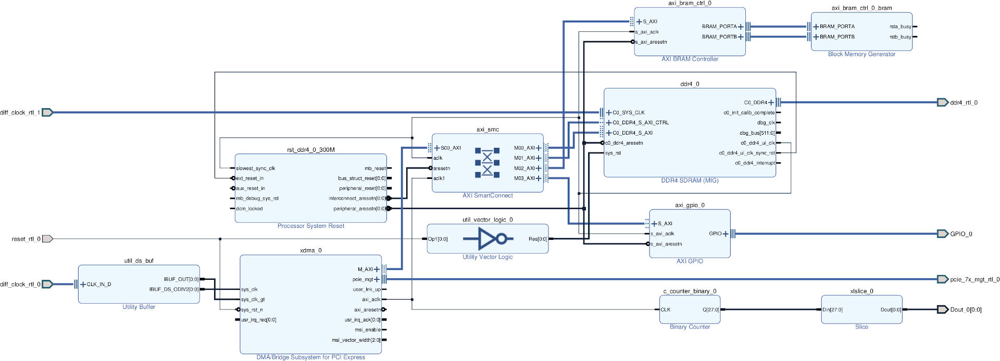
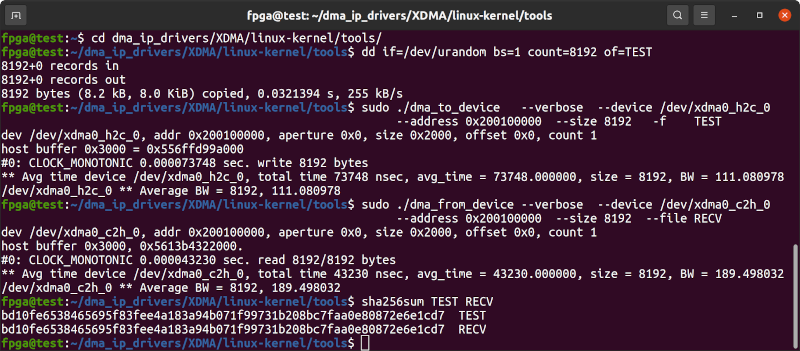
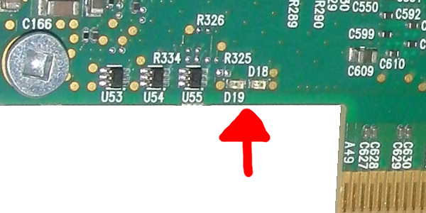
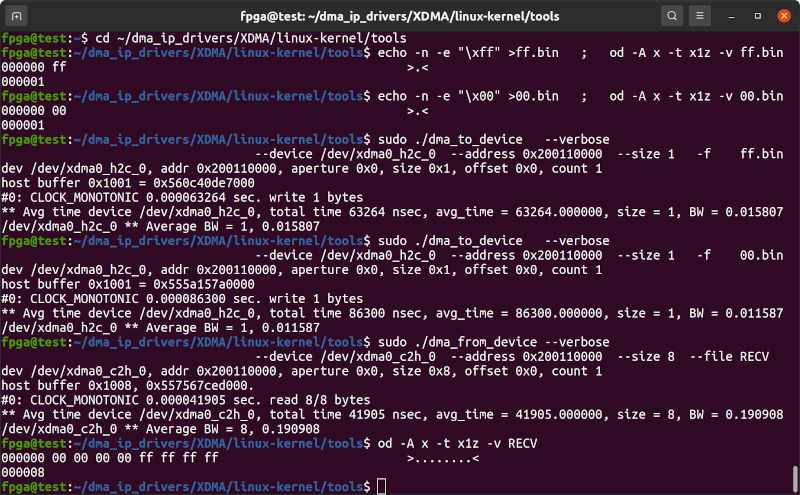
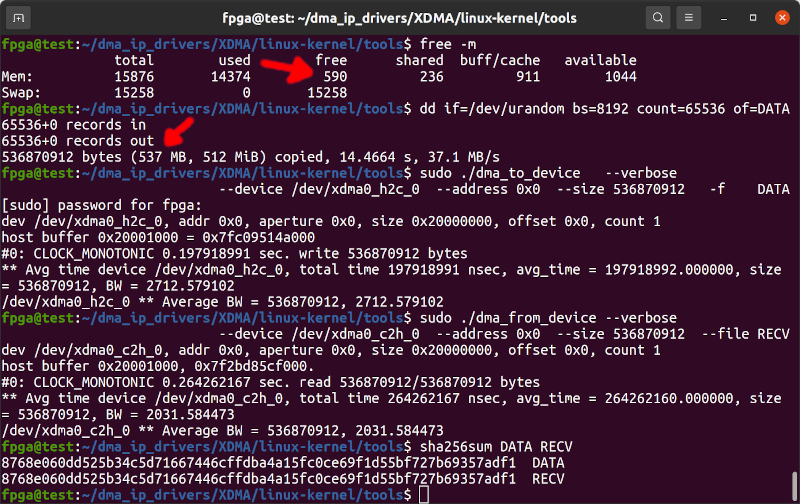
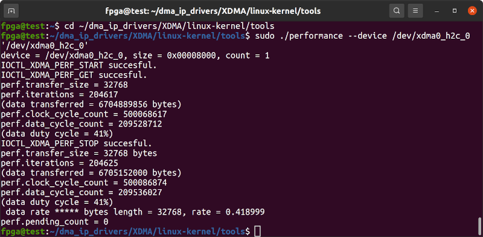
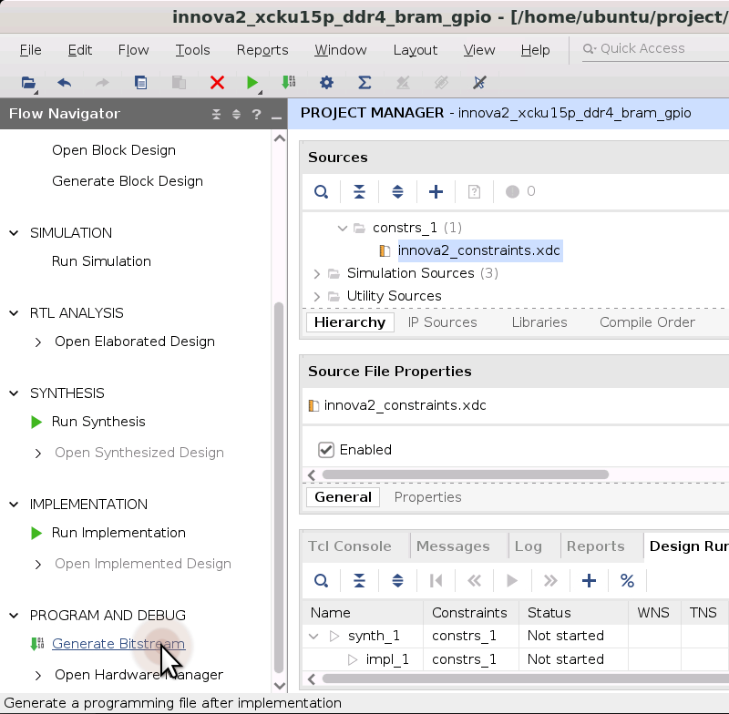

# Innova-2 Flex XCKU15P DDR4 and GPIO Demo

This is a simple [Vivado 2021.2](https://www.xilinx.com/support/download/index.html/content/xilinx/en/downloadNav/vivado-design-tools/2021-2.html) project for the [Innova-2 Flex SmartNIC MNV303212A-ADL](https://www.nvidia.com/en-us/networking/ethernet/innova-2-flex/) that implements DDR4 and a GPIO output to one of the LEDs. The other LED is connected to a divided down clock and blinks every couple of seconds.

{width=800}

Refer to the [innova2_flex_xcku15p_notes](https://github.com/mwrnd/innova2_flex_xcku15p_notes/) project for instructions on setting up an Innova-2 system with all drivers including [dma_ip_drivers](https://github.com/Xilinx/dma_ip_drivers).

## Program the Design into the XCKU15P Configuration Memory

Refer to the `innova2_flex_xcku15p_notes` project's instructions on [Loading a User Image](https://github.com/mwrnd/innova2_flex_xcku15p_notes/#loading-a-user-image). Binary Memory Configuration Files are included in this project.

```
sha256sum *bin
d3fb430f890ee90c7284a59d786135055aed494edc51cf826d5c1a03e4423b65  innova2_xcku15p_ddr4_bram_gpio_primary.bin
b9f013751c980a68a3db0373ca14d279f619dd59f6a5ac488f43d13e540c193b  innova2_xcku15p_ddr4_bram_gpio_secondary.bin
```

## Testing the Design

After rebooting, communicate with the design using the Xilinx XDMA Test programs from *dma_ip_drivers*. The following memory map is used by the block design.


| Block        | Address (Hex)      | Size  |
| ------------ |:------------------:| :---: |
| DDR4         | 0x0000000000000000 |  8G   |
| DDR4 Control | 0x0000000200000000 |  1M   |
| BRAM         | 0x0000000200100000 |  8K   |
| GPIO         | 0x0000000200110000 |  64K  |


### AXI BRAM Communication

The commands below generate 8kb of random data, then send it to a BRAM in the XCKU15P, then read it back and confirm the data is identical. Note `h2c` is *Host-to-Card* and `c2h` is *Card-to-Host*. The address of the BRAM is `0x200100000` as noted above.
```Shell
cd ~/dma_ip_drivers/XDMA/linux-kernel/tools/
dd if=/dev/urandom bs=1 count=8192 of=TEST
sudo ./dma_to_device   --verbose --device /dev/xdma0_h2c_0 --address 0x200100000 --size 8192  -f    TEST
sudo ./dma_from_device --verbose --device /dev/xdma0_c2h_0 --address 0x200100000 --size 8192 --file RECV
sha256sum TEST RECV
```




### AXI GPIO Control



The design includes an [AXI GPIO](https://docs.xilinx.com/v/u/3.0-English/ds744_axi_gpio) block to control Pin A6, the *D19* LED on the back of the Innova-2. The LED can be turned off by writing a `0x01` to the `GPIO_DATA` Register. Only a single bit is enabled in the port so excess bit writes are ignored. No direction control writes are necessary as the port is set up for output-only (the `GPIO_TRI` Direction Control Register is fixed at `0xffffffff`).


The commands below should turn off then turn on the *D19* LED. First, two one-byte files are created, an all-ones byte and an all-zeros byte. These are then sent to address `0x200110000`, the `GPIO_DATA` Register. As only a single bit is enabled in the block design, reading from `GPIO_DATA` returns `0x01` when the LED is off and `0x00` when it is on.
```Shell
cd ~/dma_ip_drivers/XDMA/linux-kernel/tools/
echo -n -e "\xff" >ff.bin   ;   od -A x -t x1z -v  ff.bin
echo -n -e "\x00" >00.bin   ;   od -A x -t x1z -v  00.bin
ls -l  ff.bin  00.bin
sudo ./dma_to_device   --verbose --device /dev/xdma0_h2c_0 --address 0x200110000 --size 1 -f     ff.bin
sudo ./dma_to_device   --verbose --device /dev/xdma0_h2c_0 --address 0x200110000 --size 1 -f     00.bin
sudo ./dma_from_device --verbose --device /dev/xdma0_c2h_0 --address 0x200110000 --size 8 --file RECV
od -A x -t x1z -v  RECV
```



### DDR4 Communication

Memory Management prevents data reads from uninitialized memory. DDR4 must first be written to before it can be read from.

Your system must have enough free memory to test the DDR4 DMA transfers. Run `free -m` to determine how much RAM you have available and keep the amount of data to transfer below that. The commands below generate 512MB of random data then transfer it to and from the Innova-2. The address of the DDR4 is `0x0` as noted above. Note `512MiB = 536870912 = 0x20000000` and `128MiB = 134217728 = 0x8000000` which could be generated using `bs=8192 count=16384`. To test the full memory array you can increase the address by the data size until all `8Gib = 8589934592 = 0x200000000` has been tested. If you have 8GB+ of free memory space, generate 8GB of random data with the `dd` command options `bs=8192 count=1048576` and test the DDR4 in one go.
```Shell
cd ~/dma_ip_drivers/XDMA/linux-kernel/tools/
free -m
dd  if=/dev/urandom  bs=8192  count=65536  of=DATA
sudo ./dma_to_device   --verbose --device /dev/xdma0_h2c_0 --address 0x0 --size 536870912  -f    DATA
sudo ./dma_from_device --verbose --device /dev/xdma0_c2h_0 --address 0x0 --size 536870912 --file RECV
sha256sum DATA RECV
```



### XDMA Performance

Xilinx's *dma_ip_drivers* include a simple performance measurement tool which tests at address `0x0` with a default transfer size of 32kb.
```Shell
cd ~/dma_ip_drivers/XDMA/linux-kernel/tools/
sudo ./performance --device /dev/xdma0_h2c_0
```



## Recreating the Design in Vivado

Run the `source` command from the main Vivado **2021.2** window. Only some versions of Vivado successfully implement this block design.

```
cd innova2_xcku15p_ddr4_bram_gpio
dir
source innova2_xcku15p_ddr4_bram_gpio.tcl
```


Click on *Generate Bitstream*.



When synthesis and implementation complete after about an hour and Vivado generates a programming Bitstream, run *Write Memory Configuration File*, select *bin*, *mt25qu512_x1_x2_x4_x8*, *SPIx8*, *Load bitstream files*, and a location and name for the output binary files. The bitstream will end up in the `innova2_xcku15p_ddr4_bram_gpio/innova2_xcku15p_ddr4_bram_gpio.runs/impl_1` directory as `design_1_wrapper.bit`. Vivado will add the `_primary.bin` and `_secondary.bin` extensions as the Innova-2 uses dual MT25QU512 FLASH ICs in x8 for high speed programming.


Proceed to [Loading a User Image](https://github.com/mwrnd/innova2_flex_xcku15p_notes/#loading-a-user-image)

